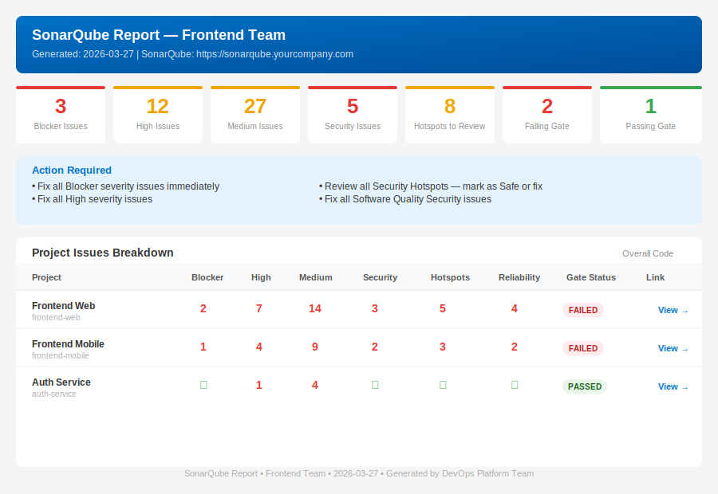

# SonarQube Report Generator

> A shell script that generates **per-team HTML security & quality reports** from SonarQube — no extra tooling, no plugins, just `curl` and `sh`.


---

## What it does

DevOps or Security teams need to answer on demand: *"Which teams still have Blocker/High/Security issues open?"*

This script hits the SonarQube REST API and produces a **self-contained HTML report per team** showing:

| Column | What it measures |
|---|---|
| Blocker | Issues with BLOCKER severity (open/confirmed/reopened) |
| High | Issues with HIGH severity |
| Medium | Issues with MEDIUM severity |
| Security Issues | Vulnerabilities at HIGH or BLOCKER level |
| Hotspots | Security hotspots in TO_REVIEW status |
| Reliability | Reliability issues at HIGH/MEDIUM level |
| Gate Status | Quality Gate result (PASSED / FAILED / WARNING) |

Summary cards at the top give a quick team-level view. Each project links directly to its SonarQube dashboard. Only the table rows scroll — the header stays fixed.

**Sample output:**



---

## Project Structure

```
sonarqube-weekly-report/
├── scripts/
│   └── sonar-report.sh   # API calls, data aggregation, report generation
├── templates/
│   └── report.html              # HTML/CSS template with {{PLACEHOLDERS}}
├── examples/
│   └── teams.conf.example       # Multi-team configuration example
└── docs/
    ├── sample-report.html       # Preview the report in a browser
    └── assets/
        └── report-preview.svg   # README screenshot
```

---

## Roadmap

| Phase | Status | Description |
|---|---|---|
| **Phase 1** | ✅ Current | Manual — run the script on demand, share HTML files |
| **Phase 2** | Planned | Cron / CI scheduled runs |
| **Phase 3** | Planned | Email delivery — auto-send report to team leads |
| **Phase 4** | Planned | Slack integration — post summary card to team channels |
| **Phase 5** | Planned | Jenkins / Devtron pipeline stage — report as build artifact |

---

## Phase 1 — Manual Generation

### Prerequisites

| Requirement | Notes |
|---|---|
| `sh` / `bash` | Any POSIX shell; tested on macOS zsh, Linux bash, Alpine sh |
| `curl` | Must be installed and in `$PATH` |
| `awk` | Standard on all POSIX systems |
| SonarQube token | Needs **Browse** permission on all projects (or Global Admin) |
| Network access | Machine running the script must reach `SONAR_HOST_URL` |

### 1. Clone the repo

```sh
git clone https://github.com/your-org/sonarqube-report.git
cd sonarqube-report
```

### 2. Configure the script

Open `scripts/sonar-report.sh` and update the top section:

```sh
SONAR_HOST_URL="https://sonarqube.yourcompany.com"   # your SonarQube URL
SONAR_ADMIN_TOKEN="sqp_xxxxxxxxxxxx"                 # your token

TEAMS="
frontend
backend
platform
"
```

> **Token tip:** Generate at *SonarQube → My Account → Security → Tokens*.
> Use type **User Token** with Browse permission, or a **Global Analysis Token** if you have Global Admin.

See [examples/teams.conf.example](examples/teams.conf.example) for a multi-team example.

### 3. Run the script

```sh
sh scripts/sonar-report.sh
```

Expected output:

```
[INFO]    Generating report for team: frontend
[INFO]      Processing: frontend-web
[INFO]      Processing: frontend-mobile
[SUCCESS] Report saved: sonarqube-report-frontend-2026-03-27.html
[INFO]    Generating report for team: backend
...
============================================================
  ALL TEAM REPORTS GENERATED
  Date: 2026-03-27
  Reports saved as: sonarqube-report-[team]-2026-03-27.html
============================================================
```

### 4. Share the reports

Open the generated `.html` files in any browser — fully self-contained, no external CSS/JS dependencies.

Options for sharing:
- Email as attachment
- Upload to S3 / GCS bucket with a public/signed URL
- Commit to a `reports/` branch and share GitHub Pages link
- Upload to Confluence as an attachment
- Post in a Slack message

---

## Configuration Reference

### TEAMS format

```
TEAMS="
frontend
backend
platform
"
```

- **TEAM_NAME** — used as the report filename (`sonarqube-report-TEAM_NAME-DATE.html`) and header. Use lowercase with hyphens.
- Projects are **auto-discovered** from SonarQube using the team name as a search prefix — no need to list project keys manually.

### Environment variable override (optional)

Instead of hardcoding the token in the script, export it before running:

```sh
export SONAR_ADMIN_TOKEN="sqp_xxxxxxxxxxxx"
sh scripts/sonar-report.sh
```

### Customising the report layout

Edit `templates/report.html` directly — it uses `{{PLACEHOLDER}}` tokens that the script substitutes at runtime. No changes to the script needed for visual changes.

---

## How it works

The script uses four SonarQube REST API endpoints:

```
GET /api/issues/search               — issue counts by severity/type
GET /api/hotspots/search             — security hotspot counts
GET /api/qualitygates/project_status — quality gate result
GET /api/projects/search             — resolve project display name
```

It then fills `templates/report.html` using `awk`, replacing `{{PLACEHOLDER}}` tokens with live data and streaming the per-project table rows in. No SonarQube plugins or server-side configuration required.

---

## Troubleshooting

**All counts show 0**
- Check that `SONAR_ADMIN_TOKEN` is correct and not expired
- Verify network connectivity: `curl -u "$SONAR_ADMIN_TOKEN:" "$SONAR_HOST_URL/api/system/status"`

**`UNKNOWN` quality gate**
- The project key doesn't exist or the token lacks Browse permission on that project

**Special characters in team names break the filename**
- Use only lowercase letters, numbers, and hyphens in `TEAM_NAME`

---

## Contributing

1. Fork the repo
2. Create a branch: `git checkout -b feature/phase-2-cron`
3. Commit your changes
4. Open a pull request

---

## License

MIT — see [LICENSE](LICENSE)

---

*Built by the DevOps Platform Team. Feedback and PRs welcome.*
